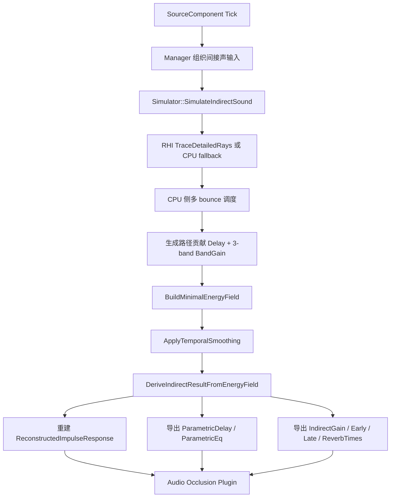
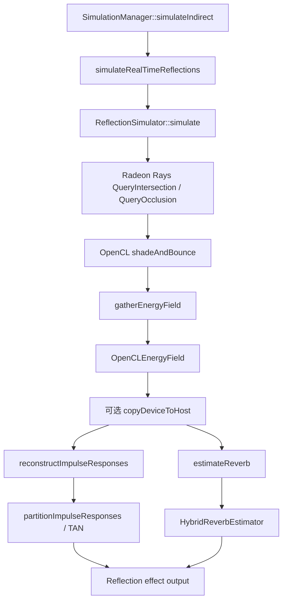
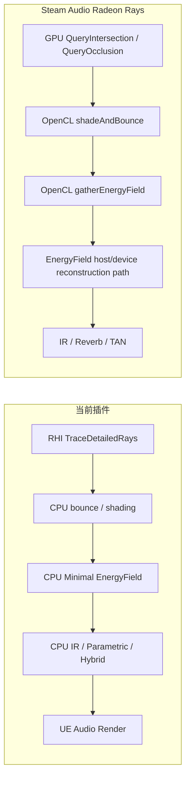

# EnergyField 流程对比：当前实现 vs Steam Audio

## 1. 目的

这份文档专门回答一个问题：

- **“使用 GPU 光追获得能量场”这件事，在当前插件里是怎么做的，在 Steam Audio 里又是怎么做的？**

重点不放在最终听感，而是放在中间数据流：

- 射线从哪里发出
- GPU 负责什么
- CPU 负责什么
- 能量场在什么阶段形成
- IR / Parametric / Hybrid 是从什么中间结果导出的

---

## 2. 先说结论

### 2.1 当前插件

当前插件已经实现了：

- **RHI 优先的 GPU 命中查询**
- **CPU 侧的 Minimal EnergyField 构建**
- **从 Minimal EnergyField 导出 IR / Parametric / Hybrid 第一版结果**

但更准确地说，当前还不是“GPU 直接生成完整能量场”，而是：

- GPU 负责：
  - 多条射线的命中查询
  - 返回 hit distance / normal / geometry index
- CPU 负责：
  - 多 bounce 调度
  - 路径贡献计算
  - 写入 delay bins
  - 3-band energy accumulation
  - temporal smoothing
  - IR reconstruction
  - parametric / hybrid 导出

所以当前实现是：

- **GPU-assisted tracing + CPU EnergyField**

### 2.2 Steam Audio

Steam Audio 的 Radeon Rays / OpenCL 路径更接近真正的“GPU 驱动能量场生成”：

- GPU 光追后端负责大量交点查询
- OpenCL kernel 负责 `shadeAndBounce`
- OpenCL kernel 负责 `gatherEnergyField`
- `OpenCLEnergyField` 在设备侧接收能量累计
- 后续再根据效果类型：
  - 重建 IR
  - 估计 reverb
  - 生成 hybrid 参数

所以 Steam Audio 更接近：

- **GPU tracing + GPU-side energy accumulation + 后续重建**

不过要注意一个很重要的现实细节：

- Steam Audio 在 Radeon Rays 路径下，**并没有完整实现 OpenCL 上的跨帧 EnergyField accumulation**
- 所以它在 `SimulationManager::hasSceneChanged()` 里会直接把 `RadeonRays` 视为“scene always changed”
- 这意味着它会避免依赖那条还不完整的 GPU 帧间累积路径

这点非常值得参考。

---

## 3. 当前插件的 EnergyField 流程

## 3.1 总体流程

---

## 3.2 GPU 参与到哪一步

当前 GPU 主要参与的是：

- `TraceDetailedRays(...)`

位置：

- `Source/UERayTracingAudioSDK/Public/RayTracing/UERayTracingAudioRayTracingDevice.h`
- `Source/UERayTracingAudioSDK/Private/RayTracing/UERayTracingAudioRayTracingDevice.cpp`

它做的事是：

1. 用导出的几何构建声学用 BLAS / TLAS
2. 对一批 bounce rays 做硬件光追命中查询
3. 返回每条射线的：
   - 是否命中
   - 命中距离
   - 命中法线
   - 几何索引

对应逻辑入口：

- `FUERayTracingAudioRayTracingDevice::TraceDetailedRays(...)`

当前并不是 GPU 直接输出 EnergyField，而是只输出：

- **逐 ray 的 hit 信息**

---

## 3.3 CPU 如何把 GPU 命中结果变成 EnergyField

真正把路径贡献写成 EnergyField 的逻辑在：

- `Source/UERayTracingAudioSDK/Private/Simulation/UERayTracingAudioSimulator.cpp`

关键步骤如下。

### 步骤 1：多 bounce 路径追踪

`SimulateIndirectSound(...)` 会：

- 先生成一批初始反射方向
- 对当前 active paths 批量发射 bounce rays
- 如果 RHI 可用，优先调用：
  - `RayTracingDevice.TraceDetailedRays(...)`
- 如果 RHI 不可用，就回退到：
  - CPU `TraceAcousticScene(...)`

这一层的本质是：

- **GPU 或 CPU 只负责“命中了哪里”**

### 步骤 2：从命中结果计算路径贡献

每条有效路径在 CPU 侧继续计算：

- 总传播距离
- delay
- 各频带吸收后能量
- 几何衰减
- bounce 衰减

最终得到一个路径贡献结构：

- `DelaySeconds`
- `BandGain`

这里的 `BandGain` 就是后续写入 EnergyField 的原始能量贡献。

### 步骤 3：写入 Minimal EnergyField

`BuildMinimalEnergyField(...)` 会把每条路径按 delay 落到某个 bin：

- `DelayBinEnergy[bin] += BandGain`

当前的 EnergyField 结构是：

- `DurationSeconds`
- `DelayBinDurationSeconds`
- `EarliestArrivalSeconds`
- `EarlyLateSplitSeconds`
- `TArray<FVector> DelayBinEnergy`

其中：

- 每个 `FVector` 表示 3 个频段的能量

也就是说当前实现是：

- **时间维度：有**
- **频带维度：有**
- **方向维度：暂时没有**

所以它是一个：

- **Minimal EnergyField**

### 步骤 4：做 temporal smoothing

`ApplyTemporalSmoothing(...)` 会使用 source actor 作为 key 保存一份历史：

- `GIndirectEnergyFieldHistory`

然后对每个 delay bin 做指数平滑。

这一步的意义是：

- 防止单帧 ray sampling 抖动导致结果突然跳变

### 步骤 5：从 EnergyField 导出结果

`DeriveIndirectResultFromEnergyField(...)` 会从 EnergyField 导出：

- `IndirectGain`
- `EarlyReflectionGain`
- `LateReverbGain`
- `ReverbTimes`
- `ReconstructedImpulseResponse`
- `ParametricDelaySeconds`
- `ParametricEq`

所以当前实现的结构非常清晰：

- **路径 -> Minimal EnergyField -> IR / Parametric / Hybrid**

---

## 3.4 当前插件在音频侧怎么消费这些结果

位置：

- `Source/UERayTracingAudio/Private/Audio/UERayTracingAudioOcclusion.cpp`

当前播放链路是：

- `ReconstructedImpulseResponse`
  - 作为第一版 IR / early convolution 近似
- `ParametricDelaySeconds + ParametricEq + ReverbTimes`
  - 作为参数化尾部混响输入

也就是说当前已经进入：

- **EnergyField -> Audio Render**

但仍然不是完整生产级卷积器。

---

## 3.5 当前实现的关键特点

### 优点

- 已经建立了正确中间层：
  - `EnergyField`
- 已经不再直接把路径硬堆成几个 gain
- 已经能从 EnergyField 导出：
  - IR
  - Parametric
  - Hybrid
- 已经支持：
  - RHI path queries
  - CPU fallback

### 限制

- GPU 只负责 hit query，不直接积累完整能量场
- bounce 调度仍在 CPU
- EnergyField 只有：
  - 时间
  - 频带
- 还没有：
  - 方向场
  - 球谐
  - 完整 GPU accumulation
  - 生产级长 IR 卷积器

---

## 4. Steam Audio 的 EnergyField 流程

## 4.1 总体流程

---

## 4.2 Steam Audio 在哪里真正把 GPU tracing 变成能量场

这部分最关键的实现，在：

- `core/src/core/radeonrays_reflection_simulator.cpp`

Steam Audio 的 Radeon Rays 路径核心步骤如下。

### 步骤 1：generate listener rays

在反射模拟入口里：

- `generateListenerRays(...)`

会先生成从 listener 出发的射线分布。

这点和我们当前从 source 发 ray 的方式不同。

### 步骤 2：GPU 交点查询

每个 bounce 都会先调用：

- `QueryIntersection(...)`

随后还会调用：

- `QueryOcclusion(...)`

也就是说：

- Radeon Rays 负责大规模光追求交
- 这一步是 GPU tracing backend

### 步骤 3：shadeAndBounce

然后 Steam Audio 不只是拿 hit distance 就回 CPU。

它会继续在 OpenCL kernel 里做：

- `shadeAndBounce(...)`

这一层会把：

- hit
- normal
- material
- diffuse sampling
- energy attenuation
- 下一次 bounce rays

都留在 GPU / OpenCL 这一侧继续推进。

这一步本质上比我们当前实现更深入：

- **它不是 GPU 提供 hit，CPU 再算**
- **而是 GPU / OpenCL 继续做着色与 bounce 推进**

### 步骤 4：gatherEnergyField

紧接着 Steam Audio 会在每个 bounce 后调用：

- `gatherEnergyField(...)`

它会把路径上的能量写入：

- `OpenCLEnergyField`

而不是像我们这样先生成一个 CPU `Contributions` 数组。

这一点是两者最大的结构区别。

可以把 Steam Audio Radeon Rays 路径理解成：

- **GPU tracing results**
- **-> GPU/OpenCL shading**
- **-> GPU/OpenCL energy histogram / field accumulation**

而当前插件是：

- **GPU tracing results**
- **-> CPU shading / bounce / energy accumulation**

---

## 4.3 Steam Audio 的能量场之后怎么走

在 `SimulationManager` 里，实时反射后续会做几件事：

### 1. `copyEnergyFieldsFromDeviceToHost()`

如果当前是 `RadeonRays` 且不是 `TrueAudioNext`，会把 `OpenCLEnergyField` 从设备复制回主机。

### 2. `reconstructImpulseResponses()`

如果当前反射类型不是纯 parametric：

- 从 EnergyField 重建 IR

### 3. `estimateReverb()`

如果是 `Parametric` 或 `Hybrid`：

- 从 EnergyField 估计 reverb times

### 4. `estimateHybridReverb()`

如果是 `Hybrid`：

- 再结合 IR 估计 hybrid EQ 和 delay

### 5. `partitionImpulseResponses()`

如果是卷积类路径：

- 把 IR 分区
- 交给 overlap-save FIR
- 或交给 TAN

所以 Steam Audio 不是“路径结果直接等于音频结果”，而是严格分层：

- **Ray tracing**
- **EnergyField**
- **IR / Reverb estimation**
- **Audio effect**

---

## 4.4 Steam Audio 一个很重要的现实细节

`SimulationManager::hasSceneChanged()` 里有一段非常关键的注释：

- `We don't currently have an implementation of energy field accumulation in OpenCL.`

含义是：

- Radeon Rays 路径虽然已经有 GPU / OpenCL 版的反射模拟和 EnergyField gather
- 但**跨帧 accumulation** 并没有完整地在 OpenCL 上实现

所以 Steam Audio 对 `RadeonRays` 的处理是：

- 直接认为 scene 总是 changed
- 不走稳定的 GPU 帧间 accumulation

这说明一件事：

- **“完整 GPU 能量场”其实很难做**
- 即使 Steam Audio 本身，也是在不同阶段把一部分累积逻辑放回 CPU / host 侧处理

这也是为什么我们当前先做：

- RHI hit query
- CPU Minimal EnergyField

是合理的工程路线。

---

## 5. 两套流程的并排对比

## 5.1 数据流对比

## 5.2 关键区别

### 当前插件

- GPU 负责命中查询
- CPU 负责反射路径推进
- CPU 负责写 EnergyField
- CPU 负责 IR / Parametric / Hybrid 导出

### Steam Audio

- GPU tracing backend 负责大量交点查询
- OpenCL kernel 继续做 shading 和 bounce
- OpenCL kernel 直接 gather 到 EnergyField
- 后续再做 host/device reconstruction 与 effect 输出

---

## 6. 对我们后续实现的启发

如果要继续朝 Steam Audio 靠近，下一步最值得做的不是直接补更多 heuristic，而是逐步把：

- CPU bounce / accumulation

推进成：

- GPU / compute side contribution accumulation

建议后续路线：

### 路线 A：先把当前 Minimal EnergyField 做稳

- 提高 bin 设计质量
- 把 temporal smoothing 做得更稳
- 提高 RT60 / EQ / delay 拟合质量
- 让 IR reconstruction 更接近真实卷积输入

### 路线 B：把 GPU 责任继续前推

- 不只返回 hit info
- 让 GPU 侧输出更接近：
  - per-path contribution
  - per-delay-bin contribution
  - per-band histogram

### 路线 C：最终向方向场推进

- 在当前 delay bins + 3-band 基础上增加方向维度
- 再进一步扩展到球谐 / Ambisonics 风格的能量场

---

## 7. 一句话总结

- **当前插件已经建立了“RHI 命中查询 -> CPU Minimal EnergyField -> IR / Parametric / Hybrid”的正确分层，但 GPU 目前只负责命中查询。**
- **Steam Audio 的 Radeon Rays 路径更进一步，它会把 GPU 光追命中继续交给 OpenCL kernel 做 shading、bounce 和 gatherEnergyField，从而更接近真正的“GPU 侧生成能量场”。**
